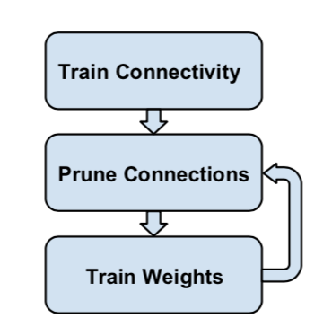
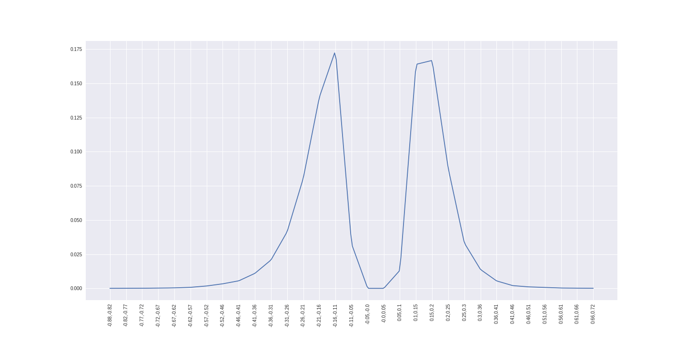
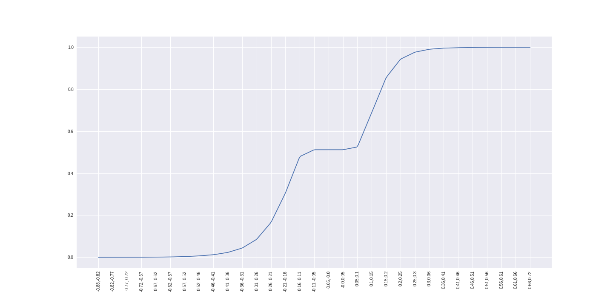

# Neural Networks Compression

[](https://docs.python.org/3/)
[](https://github.com/psf/black)
[](http://mypy-lang.org/)
[](https://pycqa.github.io/isort/)

Implementation of neural network compression from [Deep Compression: Compressing Deep Neural Networks with Pruning, Trained Quantization and Huffman Coding](https://arxiv.org/abs/1510.00149) and [Learning both Weights and Connections for Efficient Neural Networks](https://arxiv.org/abs/1506.02626).

[Quick presentation](https://docs.google.com/presentation/d/1zhzdDFtN-13fnuI6Ni400xstSfT1EStweuqKMQHU8R4/edit?usp=sharing).

[Detailed report](https://drive.google.com/file/d/1ouklIYGDD9w9Mprm9M4klhFrdcmf5fCi/view?usp=sharing).

<!-- TABLE OF CONTENTS -->
## Table of Contents

* [Abstract](#abstract)
* [Description](#description)
* [Usage](#usage)
* [References](#references)

### Abstract

Neural networks are both computationally and memory intensive.
This is why it is difficult to deploy then on embedded systems with limited hardware resources.

The aim of this project is to compress a neural network with pruning and quantization without accuracy degradation.

The experiments are executed on the [MNIST classification problem](https://en.wikipedia.org/wiki/MNIST_database), with the following neural networks: `LeNet300-100` and `LeNet5`.

### Pruning

The pruning phase consists of three steps :

- train connectivity as usual

- prune connection: remove all the weights below a threshold

-  train the weights: re-train the neural network and repeat from step 2




It is significant to note that:

- the first step is conceptually different from the way a neural network is normally trained because in this step we are interested in finding the important connection rather than the final weights
- retraining the pruned neural network is necessary because after the remotion of some connection the accuracy will inevitably drop
- pruning works under the hypothesis that the network is over-parametrized so that it solves not only memory isssues but also it can reduce the risk of overfitting


The regularization terms used in the loss function, tends to lower the magnitude of the weight matrices, so that more weights close to zero will become good candidates to be pruned.

For my experiments, I used the `L2 regularization` .

The threshold value for pruning, is obtained as a quality parameter multiplied by the standard deviation of the layer's weights.
 This choice is justified by the fact that as it is the case of my experiments, the weights of a dense/convolutional layers are distributed as a gaussian of zero mean, so that the weights in the range of the positive and negative standard deviation are the `68%` of the total.


### Quantization

After pruning, the network is further compressed by reducing the number of bits to represent the single weights.

In particular I applied `k-means`  to the weights of each layer to cluster them into representative centroids.

If we want to quantise the weights with `n` bits, we can use up to `2*n` centroids.
`more bits => better precision => more memory impact`

There are 3 ways to initialize centroids:

- forgy: random choice among the weights

- density based: consider the cumulative distribution of weights (cdf) and takes the x-values at different fixed y-values (cdf)

- linear: consider equal sized intervals as centroids between the minimum and maximum weight

To fully differentiate the initialization methods, it is important to note the weights of a single layer are distributed as a bimodal distribution after the pruning.






This means that:

1. forgy and density based, will place the weights around the two peaks because it is where weights are concentrated and the cdf varies the most. 

   The drawback is that very few centroids will have large absolute value which results in poor representation of the few large weights.

2. linear, equally space the range of weights, so it does not suffer from the previous problem

### Experiments

To run the experiments, first install and configure `poetry`:
```shell
curl -sSL https://raw.githubusercontent.com/python-poetry/poetry/master/get-poetry.py | python
poetry config virtualenvs.in-project true
```

Then clone the repository:
```shell script
git clone git@github.com:angelocatalani/neural-network-compression.git
```
and change directory:
```shell script
cd neural-network-compression
```
 
Then, install dependencies:
```shell script
poetry install
```

The `main.py` contains some experiments with `LeNet300100` , multiple threshold values and different `k-means` initialisation mode:
```shell script
poetry run neural_network_compression/main.py
```

TODO: add experiments with `LeNet5`

### References

- [Learning both Weights and Connections for Efficient Neural Networks - Song Han, Jeff Pool, John Tran, William J. Dally](https://arxiv.org/abs/1506.02626). 

- [Deep Compression: Compressing Deep Neural Networks with Pruning, Trained Quantization and Huffman Coding - Song Han, Huizi Mao, John Tran, J.Dally](https://arxiv.org/abs/1510.00149).

